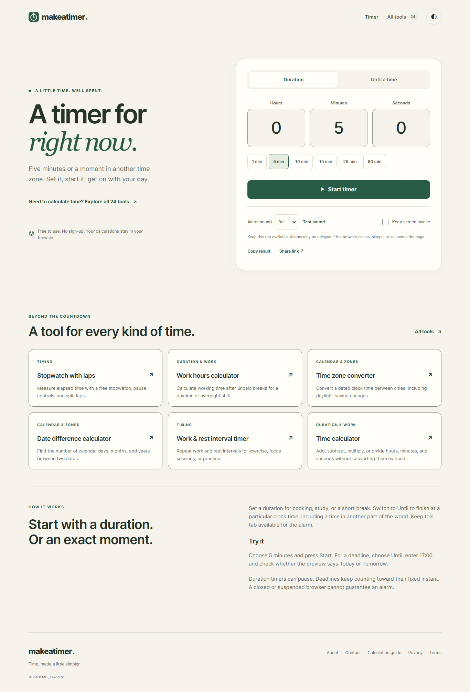

# Makeatimer

A free, open-source collection of 24 timers and time calculators. Static Astro pages with Svelte interfaces, TypeScript calculation modules, decimal duration arithmetic, and Temporal calendar/time-zone handling. No accounts, database, or calculation API.

Use the tools at [makeatimer.com](https://makeatimer.com).



## Run locally

Use Node.js 22.12 or newer (Node 24 recommended).

```sh
npm ci
npm run dev
```

Open the local address printed by Astro. No credentials are required. Advertising is disabled by default.

## Tools

- Timing: duration/deadline timer, event countdown, stopwatch with laps, work/rest intervals.
- Duration and work: time arithmetic, duration totals, clock differences, work hours, weekly timesheet/CSV, decimal hours, unit conversion, start/finish time.
- Calendar and zones: date differences, date offsets, custom business days, weekday, ISO week, time-zone conversion, meeting overlap.
- Specialist: playback length, speech estimate, running pace, render estimate, frames to duration.

## Verify

```sh
npm run verify
npx playwright install chromium firefox webkit
npm run browser-check
npm run ad-check
npm run performance-check
```

The browser check starts its own local static server and verifies the built output. It checks every calculator, share round trips, invalid inputs, timer recovery, intervals, laps, CSV, fullscreen, directory filtering, and mobile/tablet layouts. Screenshots stay in ignored `output/playwright/`. WebKit/device emulation is not a test on a physical iPad.

## Calculation rules

Durations accept `H:MM` or `H:MM:SS`. Clock calculations use fixed durations; calendar calculations use the Gregorian calendar. Time-zone conversions reject nonexistent times and require an explicit earlier/later selection for repeated times. Fixed PST is separate from seasonal Los Angeles time.

Browser alarms cannot guarantee execution while a tab is closed, frozen, discarded, or the device is asleep. Timers recover from timestamps when execution resumes. Session storage isolates timing state to a tab; local storage holds theme, sound preference, and favourites. Device clock changes affect elapsed timing.

Share links use readable, versioned parameters in the fragment. They restore editable inputs without starting timing or requesting permissions. Deadline links preserve the absolute instant and display zone. Links are not confidential.

## Build and deploy

```sh
npm run build
npm run preview
```

Deploy `dist/` as Cloudflare Workers Static Assets using `wrangler.jsonc`. See [deployment instructions](docs/deployment.md). Default builds are previews with `noindex` and advertising off. Production requires confirmed operator/contact configuration and `PUBLIC_LAUNCH_READY=true`; keep that flag false for previews.

The explicit production command applies the public operator/contact defaults and enables indexing. Run checks before deploying:

```sh
npm run check
npm test
npm run build:production
npm run deploy
```

`npm run deploy` rejects a preview build. Credentials stay in Wrangler's login or managed deployment secrets. Public `workers.dev` and version preview URLs are disabled; production serves on the custom domain.

## Source layout

`src/lib/` contains calculation/state modules and the tool registry. `src/components/` contains the interfaces. `src/pages/` generates static tool and information pages. `tests/` covers independent calculations and state transitions. `scripts/` validates build output and release configuration.

## Contributing

See [CONTRIBUTING.md](CONTRIBUTING.md). MIT licensed; see [LICENSE](LICENSE).
